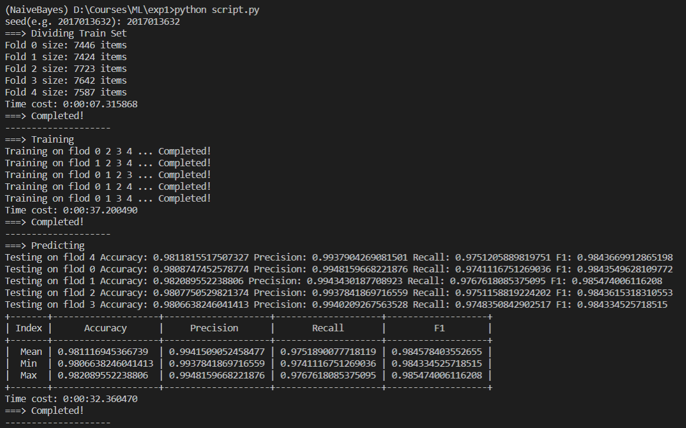

# Naïve Bayes classifier

> 石大川 2017013632
>
> mailto: sdc17@mails.tsinghua.edu.cn
>
> tel: 18801212381

### Environment

> OS: win10
>
> CPU: Intel I7-7700HQ
>
> RAM: 16G

```bash
conda create -n NaiveBayes python=3.7
conda activate NaiveBayes
conda install -c conda-forge --yes --file requirements.txt
```

If ```conda-forge```  fails, replace it with any other available channels

### DIR

```bash
├─.vscode
├─DataSet
├─Prob
├─Record
├─StopWords
├─trec06p # Add trec06p folder here
│  ├─data
│  │  ├─000
│  │  ├─001
│  │  ...
│  │  └─126
│  └─label
└─__pycache__
```

### RUN

```bash
python script.py
```

and then specify a seed for random, for example ```2017013632```:


Furthermore, well-trained models has been contained in the ```./prob``` folder, so just
```bash
python Predict.py
```
without kfold and training process will also be fine.

### Deatils
See [Report.pdf](./report.pdf)


